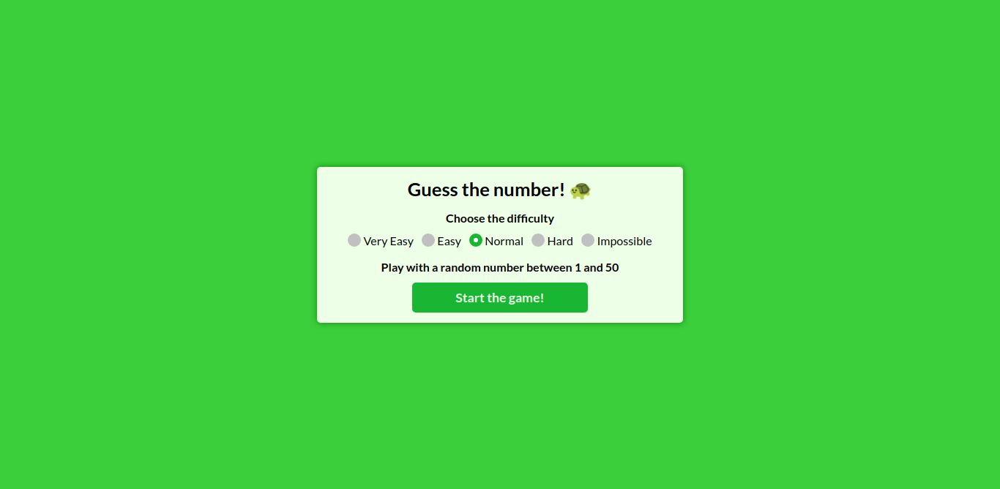

# Number Guessing Game 
A simple game of number guessing made with Vue.js

## Table of contents

- [Overview](#overview)
  - [The project](#the-project)
  - [Screenshot](#screenshot)
  - [Links](#links)
- [Process](#process)
  - [Built with](#built-with)
- [Author](#author)

## Overview

### The project

It's a simple game of number guessing, with five difficulties: very easy, easy, normal, hard and very hard (a.k.a. impossible). I used Vue for the first time in this project, so the code may be a bit disorganized and don't follow some best practices. 

### Screenshot

### Links

- [Live Site URL](https://number-guessing-game.vercel.app/)

## Process

### Built with

- HTML5
- SCSS
- JavaScript
- Vue.js

## Author

- Luiz Henrique Felix. 🐢